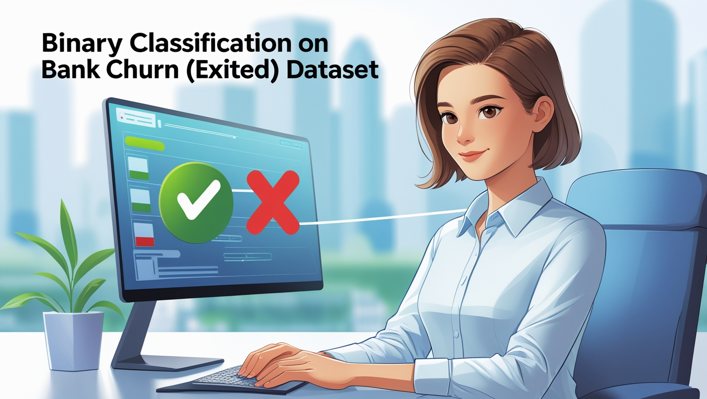

# **Bank Churn Prediction**

Predicting customer churn(Exited) is critical for banks to retain valuable clients. This project involves building a binary classification machine learning model to predict whether a customer will churn(Exited) or not based on various features

    

## **Project Overview**

This project aims to address customer churn in banking by employing a binary classification model. The predictions help stakeholders identify at-risk customers and develop retention strategies. The model leverages key features such as customer demographics, account balance, and transaction history to generate insights.

## **Feel Free to Reach out**

  <h3 class="section-title">
    <strong>Author Name:</strong>
    <a href="https://www.linkedin.com/in/yousuf-shah-7ba9492b4/" target="_blank">Yousuf Shah</a>
  </h3>
  <table>
    <tr>
      <td>
        
      </td>
      <td>
        
      </td>
    </tr>
    <tr>
      <td>
        
      </td>
      <td>
        
      </td>
    </tr>
  </table>

