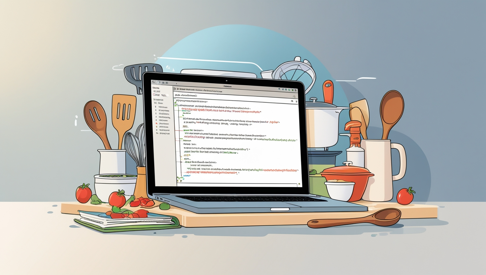

# **Recipe Management Website**

A Django-based web application that provides full CRUD (Create, Read, Update, Delete) functionality for managing recipes. This project features a user-friendly interface where users can register, log in, and manage their personalized collection of recipes seamlessly.

    

## **Project Overview**

The Recipe Management Website is designed for cooking enthusiasts and food bloggers to maintain their favorite recipes. Users can:

- Sign up and log in securely.
- Create, read, update, and delete their recipes.
- Manage their recipes via an intuitive and user-friendly interface.

## **Features**

- User Authentication:
    - Secure registration and login system.
    - User-specific recipe management.

- CRUD Functionality:
    - Add new recipes with details like name, ingredients, and instructions.
    - Edit existing recipes.
    - View recipe details.
    - Delete unwanted recipes.

 ## **Feel Free to Reach out**

 

  <h3 class="section-title">
    <strong>Author Name:</strong>
    <a href="https://www.linkedin.com/in/yousuf-shah-7ba9492b4/" target="_blank">Yousuf Shah</a>
  </h3>
  <table>
    <tr>
      <td>
        
      </td>
      <td>
        
      </td>
    </tr>
    <tr>
      <td>
        
      </td>
      <td>
        
      </td>
    </tr>
  </table>

