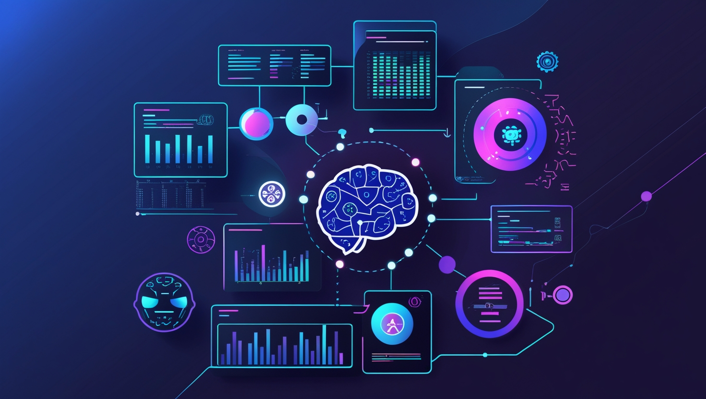

# Projects Portfolio: Data Science & Machine Learning

  <h3 class="section-title">
    <strong>Author Name:</strong>
    <a href="https://www.linkedin.com/in/yousuf-shah-7ba9492b4/" target="_blank">Yousuf Shah</a>
  </h3>
  <table>
    <tr>
      <td>
        
      </td>
      <td>
        
      </td>
    </tr>
    <tr>
      <td>
        
      </td>
      <td>
        
      </td>
    </tr>
  </table>

Welcome to my **Projects Portfolio** repository! This repository contains a collection of my work in **Data Analysis** and **Machine Learning (ML)**. Each project demonstrates my ability to explore, analyze, and model data to solve real-world problems. I am continuously learning and will be adding more projects in the future, including **Generative AI** and **Agentic AI**.

    

  
As I expand my learning, I will be adding more projects on **Generative AI**, **Deep Learning** and **Agentic AI** in the future.
